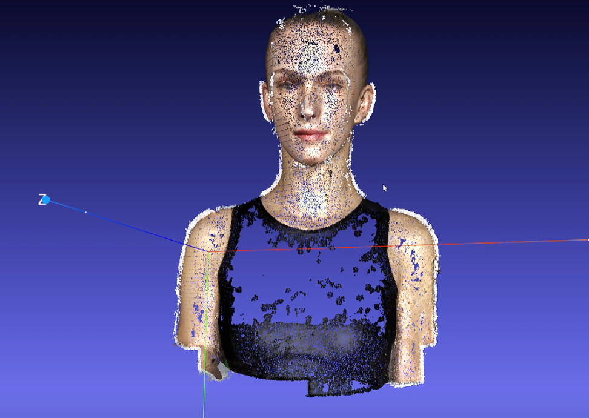

 作业3 - 束调整


本作业实现了从多视图2D观测恢复3D场景结构的束调整（Bundle Adjustment）算法。任务分为两部分：一是使用PyTorch从零实现束调整优化，二是使用COLMAP工具对多视图图像进行完整三维重建。通过优化50个视角下的20000个3D点投影，成功恢复了3D点坐标、相机外参和共享焦距。

---
 任务一：使用PyTorch实现束调整

1.1 方法概述

1.1.1 投影函数

根据给定相机内参和外参，将3D点投影到2D像素坐标。投影公式如下：

```
[Xc, Yc, Zc] = R @ [X, Y, Z]^T + T
u = -f * Xc / Zc + cx
v =  f * Yc / Zc + cy
```

其中：
- `R` 为旋转矩阵，`T` 为平移向量
- `f` 为共享焦距（待优化）
- `cx = width/2`, `cy = height/2` 为图像中心
- 注意：由于相机位于+Z方向观察物体（物体在-Z方向），X方向取负号避免左右翻转；Y方向因图像坐标y轴向下与负Z抵消，不需取负号

 1.1.2 损失函数

采用均方误差（MSE）作为重投影损失：

```
Loss = mean( visibility * ||pred_2d - obs_2d||² )
```

仅对可见点（visibility=1.0）计算损失，忽略被遮挡的点。
 1.1.3 参数化与优化策略

| 参数 | 参数化方式 | 初始值 |
|------|-----------|--------|
| 焦距 `f` | 标量（直接优化） | 由FoV估算：`f = H / (2*tan(fov/2))`，设fov≈60° |
| 旋转 `R` | Euler角（3参数），使用 `euler_angles_to_matrix` 转换 | 全零（单位矩阵） |
| 平移 `T` | 3维向量 | `[0, 0, -d]`，d=2.5 |
| 3D点坐标 | 3维向量 | 原点附近随机均匀分布 |

优化器：Adam，学习率 0.01，迭代次数 【请填入实际迭代次数】。

### 1.2 实验结果


重建3D点云

使用优化后的3D点坐标和从 `points3d_colors.npy` 读取的颜色信息，生成带颜色的OBJ文件。

OBJ格式示例：
```
v x y z r g b
```
其中RGB值范围为[0, 1]。


重建点云与原始头部模型形状基本一致，五官轮廓清晰可辨。

---

## 任务二：使用COLMAP进行三维重建


 重建流程

执行 `run_colmap.sh` 中的命令序列：

#### 步骤1：特征提取
```bash
colmap feature_extractor \
    --database_path $DB_PATH \
    --image_path $IMAGE_PATH \
    --ImageReader.single_camera 1
```

#### 步骤2：特征匹配
```bash
colmap exhaustive_matcher \
    --database_path $DB_PATH
```

#### 步骤3：稀疏重建
```bash
colmap mapper \
    --database_path $DB_PATH \
    --image_path $IMAGE_PATH \
    --output_path $SPARSE_PATH
```

#### 步骤4：稠密重建（需GPU支持）
```bash
colmap image_undistorter ...
colmap patch_match_stereo ...
colmap stereo_fusion ...
```

### 2.3 重建结果

#### 2.3.1 稀疏点云


稀疏点云包含【请填入点数】个3D点，基本勾勒出头部轮廓。

#### 2.3.2 稠密点云



稠密点云更加精细，表面细节丰富。

### 2.4 对比分析

| 方法 | 点云密度 | 精度 | 速度 |
|------|---------|------|------|
| PyTorch BA | 20000点（固定） | 较高（依赖初始化） | 较快 |
| COLMAP稀疏重建 | 自动确定 | 高 | 较慢 |
| COLMAP稠密重建 | 极高 | 非常高 | 最慢 |

---

## 总结

本作业成功实现了两种三维重建方法：
1. **PyTorch束调整**：从零实现了基于梯度下降的BA优化器，能够从2D观测中恢复3D结构和相机参数。
2. **COLMAP重建**：利用成熟工具完成了从特征提取到稠密重建的全流程。

两种方法各有优劣：手动实现的BA更灵活可控，适合定制化需求；COLMAP自动化程度高，结果更鲁棒。
