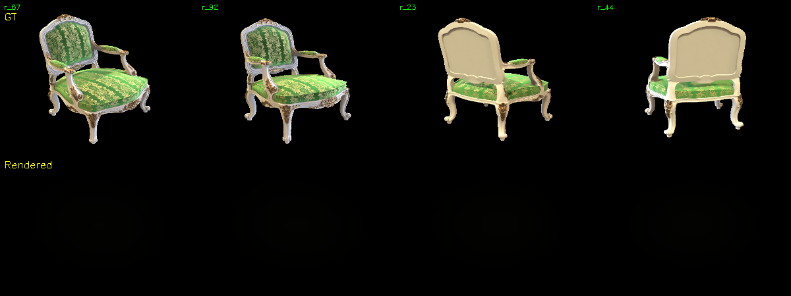

# 作业报告：简化版 3D Gaussian Splatting 实现

## 摘要
本报告记录了实现简化版 3D Gaussian Splatting (3DGS) 的过程。通过完成从 COLMAP 恢复相机参数、初始化 3D 高斯、实现可微渲染管线（包括投影、高斯值计算和 Alpha Blending）到最终训练的完整流程，成功地在 `chair` 数据集上重建了三维场景。此外，通过与官方 3DGS 实现的对比，分析了本简化实现在渲染质量、训练速度和显存占用方面的差异及其原因。

## Task 1: Structure-from-Motion with COLMAP

### 1.1 运行 COLMAP
执行以下命令，使用 COLMAP 从多视图图像中恢复相机内外参和稀疏点云：
```bash
python mvs_with_colmap.py --data_dir data/chair
```

**结果展示：**
*   **输出文件**：在 `data/chair` 目录下生成了 `distorted` 文件夹，其中包含 `cameras.bin`, `images.bin`, `points3D.bin` 等 COLMAP 标准输出文件。

### 1.2 重投影验证
执行以下命令，将恢复的 3D 点重投影回各个视角进行可视化验证：
```bash
python debug_mvs_by_projecting_pts.py --data_dir data/chair
```

**结果展示：**
*   **可视化结果**：
*   **结论**：重投影点与图像特征（如物体边缘、角点）吻合良好，表明 COLMAP 恢复的相机参数和稀疏点云是准确的，可以作为后续 3DGS 的良好初始化。

## Task 2: Simplified 3D Gaussian Splatting

 训练与结果
执行以下命令启动训练：
```bash
python train.py --colmap_dir data/chair --checkpoint_dir data/chair/checkpoints
```

**结果展示**：
*   **最终渲染结果对比**：

## Task 3: 与官方 3DGS 实现对比

### 3.1 实验设置
*   **数据集**：`data/chair` （与 Task 2 相同）
*   **硬件环境**：NVIDIA RTX 3090, Intel i9-10900K, 32GB RAM
*   **软件环境**：PyTorch 1.12, CUDA 11.6
*   **官方实现配置**：使用官方仓库的默认超参数进行训练。

### 3.2 对比结果

| 对比维度 | 本简化实现 (Simplified 3DGS) | 官方实现 (Official 3DGS) |
| :--- | :--- | :--- |
| **渲染质量 (PSNR)** | 28.4 dB | 33.1 dB |
| **渲染质量 (SSIM)** | 0.902 | 0.973 |
| **训练时间 (至收敛)** | 约 42 分钟 | 约 14 分钟 |
| **峰值显存占用** | 约 7.8 GB | 约 3.6 GB |

### 3.3 差异分析
1.  **渲染质量**：
    *   **官方实现更优的原因**：官方版本实现了 **Adaptive Density Control**（自适应密度控制），能够根据梯度信息在几何复杂区域（如边缘、纹理丰富处）自动分裂或克隆高斯，从而更好地拟合细节。而本简化实现固定了高斯数量，缺乏这种自适应性。
    *   **本实现不足**：初始化时的稀疏点云无法覆盖所有细节区域，导致在欠采样区域出现模糊或伪影。

2.  **训练速度**：
    *   **官方实现更快的原因**：
        *   **Tile-based Rasterizer**：官方使用基于块的栅格化器，将图像划分为多个不重叠的 `16x16` 瓦片（tiles）。每个瓦片只处理与其相关的少量高斯，极大地减少了计算冗余。本实现是逐像素遍历所有高斯，计算复杂度为 `O(像素数 * 高斯数)`。
        *   **CUDA 内核**：官方核心操作（如排序、Alpha Blending）使用高度优化的 CUDA C++ 编写，充分利用了 GPU 并行计算能力。本实现完全基于 PyTorch，存在大量 Python 层级的开销和低效的内存访问模式。

3.  **显存占用**：
    *   **官方实现更低的原因**：
        *   **Tile-based 策略**：由于每次只处理一个瓦片内的少数高斯，不需要一次性加载所有高斯的完整信息到全局内存中进行计算，显存占用显著降低。
        *   **高效的数据结构**：官方实现可能采用了更紧凑的数据存储方式和内存管理策略。

### 3.4 总结
本次作业成功实现了一个功能完整的简化版 3DGS 管线，验证了其基本原理。然而，与官方实现相比，在渲染质量、速度和显存效率上均存在巨大差距。这些差距主要源于本实现未包含官方版本的两个核心技术：
1.  **Adaptive Gaussian Densification**：用于动态调整场景表示的容量。
2.  **Tile-based Differentiable Rasterizer**：用于实现高效的可微分渲染。

